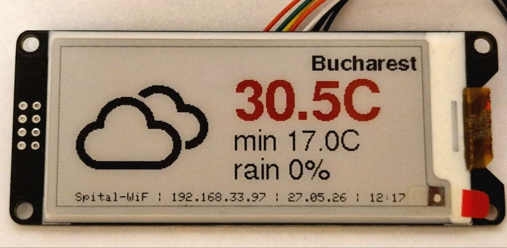

# InkCast



A self-contained weather display for a 2.9" tri-color e-paper panel, running on an ESP32-C3. It fetches weather data and geolocation automatically, shows today's forecast with a weather icon, temperatures, precipitation probability, and a status footer. All settings are configured at runtime through a browser-based portal — no recompilation needed.

## Features

- Automatic geolocation via [ip-api.com](http://ip-api.com) (no API key required)
- Daily weather forecast via [Open-Meteo](https://open-meteo.com) (no API key required)
- NTP time sync with automatic UTC offset from geolocation
- Weather icons from the [Weather Icons](https://erikflowers.github.io/weather-icons/) font, rendered at 44pt
- Current temperature (large) and min/max predicted range shown in the right column
- Precipitation probability shown as 0–5 umbrella icons
- Red color used for severe weather icon and current temperature when ≥ 30 °C / 86 °F
- Browser-based configuration portal (WiFi, units, intervals, pins) stored in NVS — survives firmware updates
- Active-low LED status signalling
- Optional deep sleep between refreshes for battery-powered use
- Optional button for manual refresh or forced portal re-entry

## Hardware

| Component | Details |
|-----------|---------|
| MCU | ESP32-C3 DevKitM-1 |
| Display | GDEM029C90, 128×296 px, 3-color (B/W/R), SSD1680 |
| Interface | SPI — CS: SS, DC: GPIO 8, RST: GPIO 9, BUSY: GPIO 10 |
| Button (optional) | GPIO 9 (default), active-low, `INPUT_PULLUP` |
| LED (optional) | GPIO 8 (default), active-low |

> The button and LED default GPIOs can be changed without reflashing from the config portal.

## Display Layout

```
+---------------------------296px--------------------------+
|  [weather  ]                              City Name      |
|  [ icon    ]         30.5C     <- current temp, 24pt bold|
|  [ 44pt    ]      17 ... 30C   <- min...max range, 12pt  |
|                   ☂ ☂ ☂        <- precip umbrellas, 12pt |
|   SSID | 192.168.x.x | 27.05.26 | 14:35  <- footer 6×8  |
+----------------------------------------------------------+
```

- Left column (0–135 px): weather icon centred at (68, 60)
- Right column (136–295 px): city name, current temp, min–max range, and umbrellas all centred within the column
- Current temperature shown in **red** when ≥ 30 °C (or 86 °F)
- Weather icon shown in **red** for severe conditions (freezing rain, heavy snow, thunderstorm)
- Precipitation probability mapped to 0–5 umbrella glyphs (one umbrella per 20 %)
- Footer spans full width, centered; SSID is trimmed to fit; date from `daily.time[0]`, time from NTP

## LED Signals

| Pattern | Meaning |
|---------|---------|
| Steady on | Config portal active |
| Slow blink (250 ms) | Connecting to WiFi |
| Fast blink (100/400 ms) | Waiting for NTP sync |
| Steady on during fetch | Network request in progress |
| 2 short flashes | Weather updated successfully |
| 3 long flashes | Error (WiFi fail or weather unavailable) |

## First-Time Setup

1. Flash the firmware with PlatformIO.
2. On first boot (no WiFi saved), the display shows the setup instructions.
3. Connect your phone or laptop to the `InkCast-XXYY` WiFi network.
4. Open `http://192.168.4.1` in a browser and fill in your settings.
5. Click **Save & Restart** — the device reboots and connects to your WiFi.

## Configuration Portal

The portal is accessible two ways:

- **At boot**: hold the button while powering on, or if no WiFi is saved — the device starts as an AP (`InkCast-XXYY`) with a captive portal DNS redirect.
- **During normal operation** (when deep sleep is disabled): navigate to `http://<device-ip>/` from any device on the same network.

### Settings

| Setting | Default | Description |
|---------|---------|-------------|
| WiFi SSID / Password | — | Your local network credentials |
| Temperature units | Celsius | °C or °F |
| Forecast days | 1 | Days fetched from Open-Meteo (display shows today only) |
| Update interval | 30 min | How often to refresh weather |
| Deep sleep duration | −1 | Minutes to sleep after each refresh. `−1` = stay awake; `0` = sleep forever (no auto-wake) |
| Button GPIO | 9 | Short press = immediate refresh; hold 5 s = enter setup |
| LED GPIO | 8 | Active-low status LED |

## Building

Requires [PlatformIO](https://platformio.org/).

```bash
pio run                        # build
pio run --target upload        # flash
pio device monitor             # serial console at 115200 baud
```

The default environment is `esp32c3`. An `esp32` environment is also defined in `platformio.ini` for a standard ESP32 dev board (adjust SPI pins in [src/display.h](src/display.h) if needed).

## Dependencies

All fetched automatically by PlatformIO:

- [GxEPD2](https://github.com/ZinggJM/GxEPD2) — e-paper display driver
- [Adafruit GFX](https://github.com/adafruit/Adafruit-GFX-Library) — font rendering
- [ArduinoJson](https://arduinojson.org/) ≥ 7.4 — JSON parsing

Weather data: [Open-Meteo](https://open-meteo.com) — free, no account needed.  
Geolocation: [ip-api.com](http://ip-api.com) — free for non-commercial use, no account needed.

## License

GPL-3.0 — see source file headers.
